# YOLO-GFL

**YOLO Architecture Optimization Using GhostNet-Based Modules for Indoor Fire and Smoke Detection**

## Overview

YOLO-GFL is an optimized YOLO architecture that incorporates GhostNet-based modules for efficient indoor fire and smoke detection. This implementation provides a lightweight yet accurate solution for real-time fire safety monitoring systems.

## Key Features

- **Lightweight Architecture**: 35% smaller model size compared to YOLOv12
- **Efficient Computation**: 21% reduction in computational complexity
- **Real-time Performance**: Optimized for edge deployment
- **High Accuracy**: Maintains competitive detection performance
- **Specialized Focus**: Designed specifically for indoor fire and smoke detection

## Model Specifications

### Dataset
- **Source**: [PENG BO Home-Fire Dataset](https://github.com/PengBo0/Home-fire-dataset)
- **Baseline Model**: [YOLOv12](https://github.com/sunsmarterjie/yolov12)

### Architecture Comparison

| Model        | Layers   | Parameters  | GFLOPs   | Model Size   | Improvement  |
|--------------|----------|-------------|----------|--------------|--------------|
| **YOLO-GFL** | 118      | 1,611,126   | 4.6      | **3.36 MB**  | Optimized    |
| **YOLOv12**  | 159      | 2,527,166   | 5.8      | 5.21 MB      | Baseline     |

## Performance Results

### Test Set Performance

<details>
<summary><strong>YOLO-GFL Results</strong></summary>

| Class   | Images | Instances | Precision   | Recall   | mAP50     | mAP50-95   |
|---------|--------|-----------|-------------|----------|-----------|------------|
| **All** | 1300   | 1586      | **0.908**   | 0.816    | **0.891** | 0.564      |
| Fire    | 852    | 897       | 0.929       | 0.818    | 0.914     | 0.590      |
| Smoke   | 618    | 689       | 0.887       | 0.813    | 0.868     | 0.539      |

</details>

<details>
<summary><strong>YOLOv12 Results</strong></summary>

| Class    | Images  | Instances   | Precision   | Recall    | mAP50     | mAP50-95   |
|----------|---------|-------------|-------------|-----------|-----------|------------|
| **All**  | 1300    | 1586        | 0.901       | **0.834** | 0.894     | **0.570**  |
| Fire     | 852     | 897         | 0.923       | **0.851** | **0.917** | **0.592**  |
| Smoke    | 618     | 689         | 0.878       | 0.816     | **0.872** | **0.548**  |

</details>

### Training Performance (300 epochs)

<details>
<summary><strong>Training Results Comparison</strong></summary>

#### YOLO-GFL Training Results
| Class    | Images  | Instances   | Precision   | Recall    | mAP50     | mAP50-95   |
|----------|---------|-------------|-------------|-----------|-----------|------------|
| **All**  | 1300    | 1580        | **0.940**   | **0.892** | 0.932     | 0.621      |
| Fire     | 894     | 963         | 0.955       | 0.918     | 0.954     | 0.671      |
| Smoke    | 574     | 617         | **0.925**   | **0.865** | **0.910** | 0.572      |

#### YOLOv12 Training Results
| Class   | Images  | Instances  | Precision   | Recall    | mAP50     | mAP50-95  |
|---------|---------|------------|-------------|-----------|-----------|-----------|
| **All** | 1300    | 1580       | 0.937       | 0.886     | **0.932** | **0.642** |
| Fire    | 894     | 963        | **0.959**   | **0.920** | **0.955** | **0.695** |
| Smoke   | 574     | 617        | 0.916       | 0.853     | 0.909     | **0.588** |

</details>

## Demo Results

### Fire Detection Comparison

| Test Case  | YOLO-GFL                                                                                   | YOLOv12                                                                                  |
|------------|--------------------------------------------------------------------------------------------|------------------------------------------------------------------------------------------|
| **Test 1** | 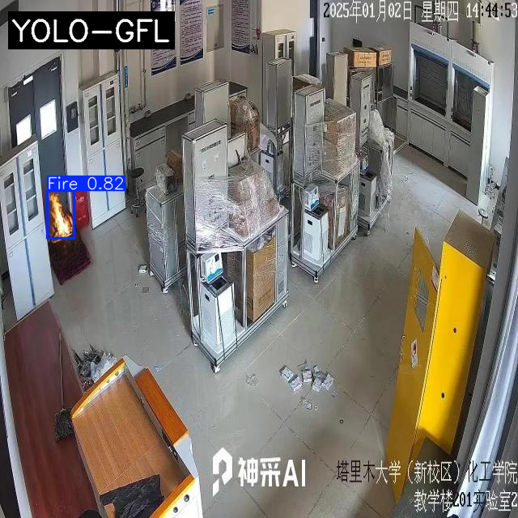 | 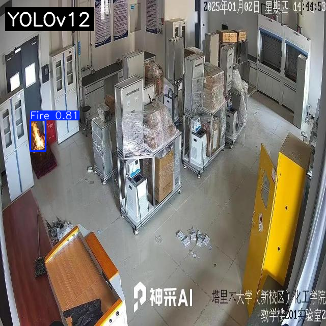 |
| **Test 2** | 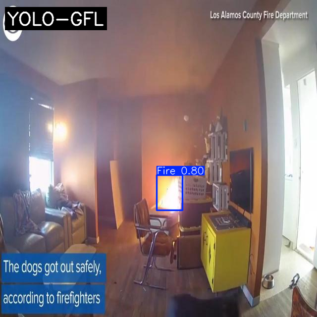 |  |
| **Test 3** | 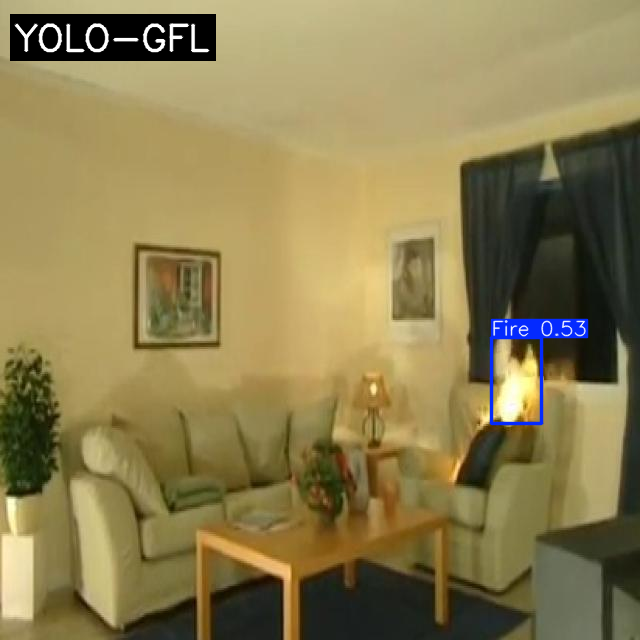 | 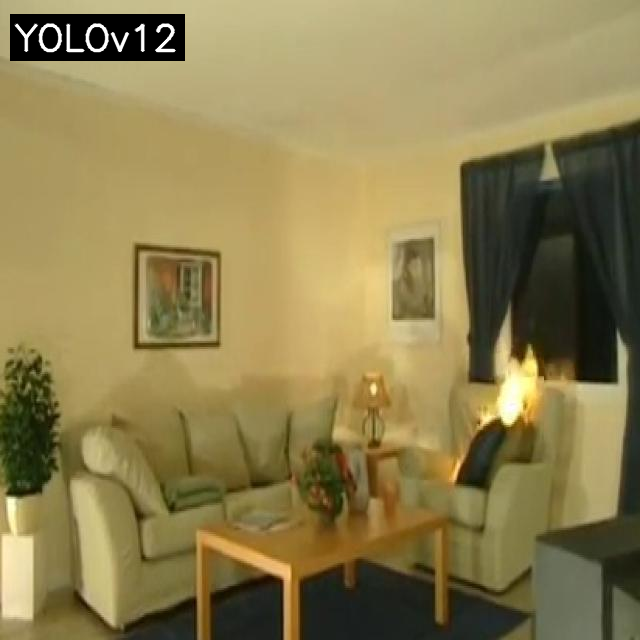 |
| **Test 4** | 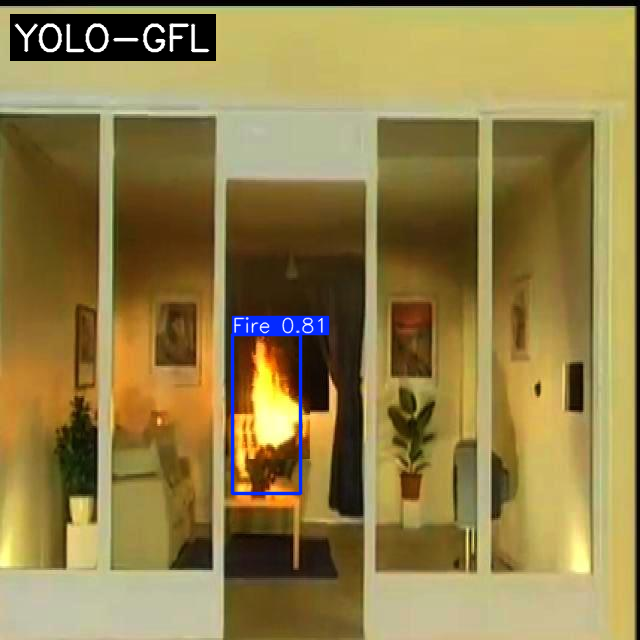 | 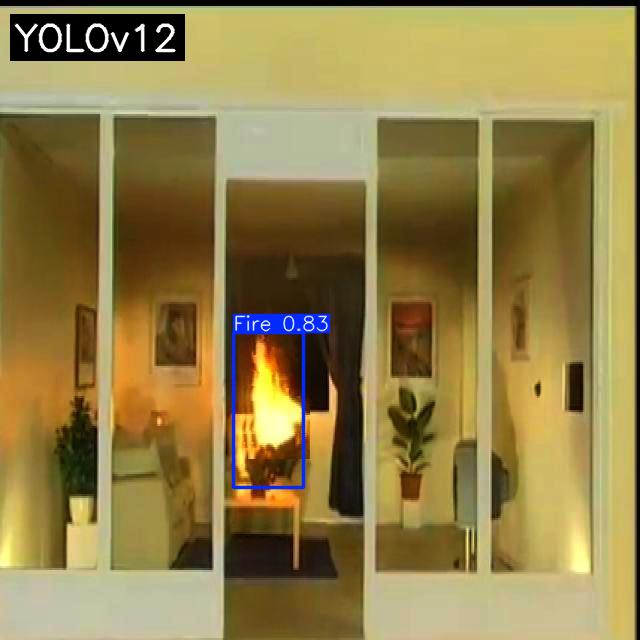 |

<details>
<summary><strong>View More Test Results</strong></summary>

| Test Case   | YOLO-GFL                                                                                   | YOLOv12                                                                                  |
|-------------|--------------------------------------------------------------------------------------------|------------------------------------------------------------------------------------------|
| **Test 5**  | 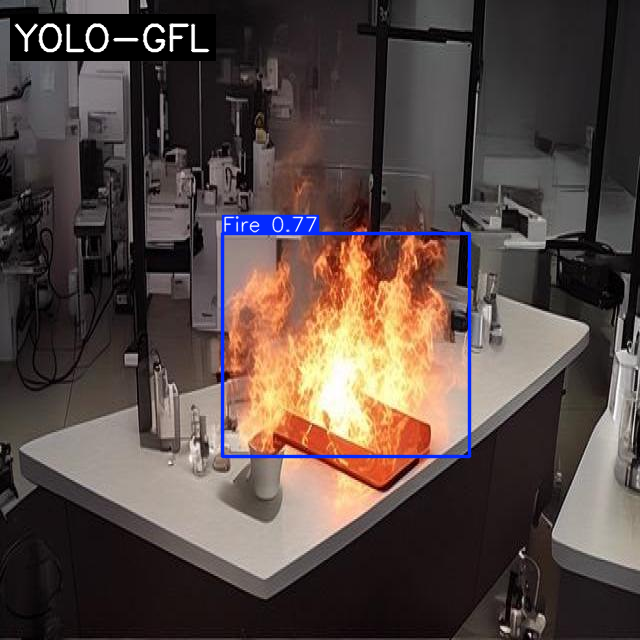 | 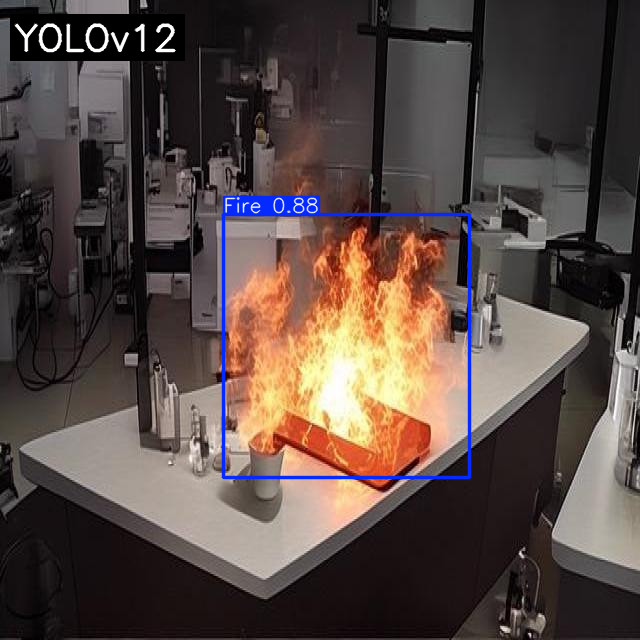 |
| **Test 6**  | 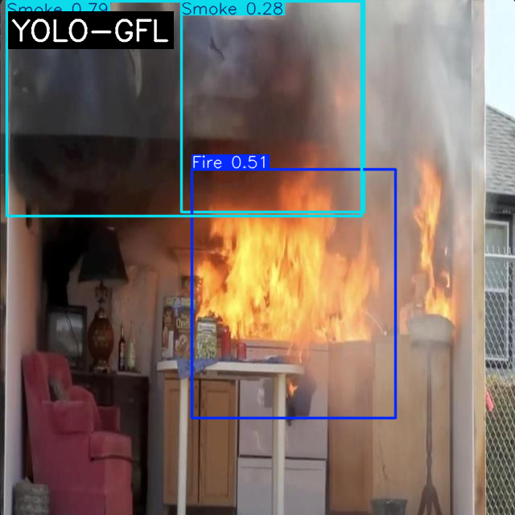 |  |
| **Test 7**  | 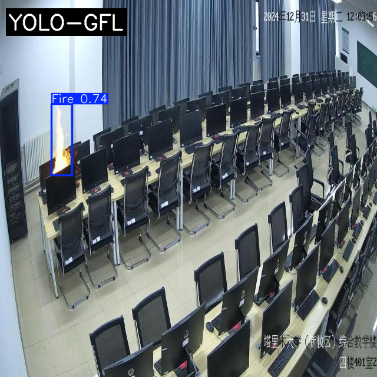 | 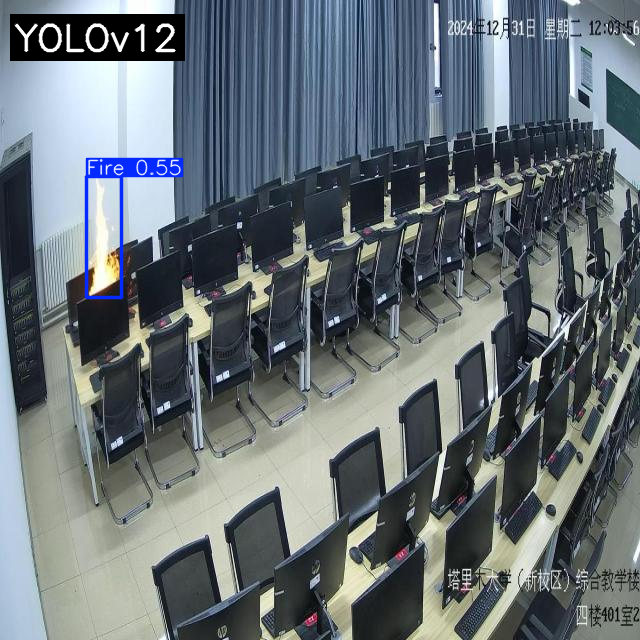 |
| **Test 8**  | 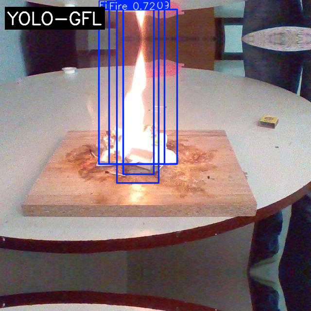 | 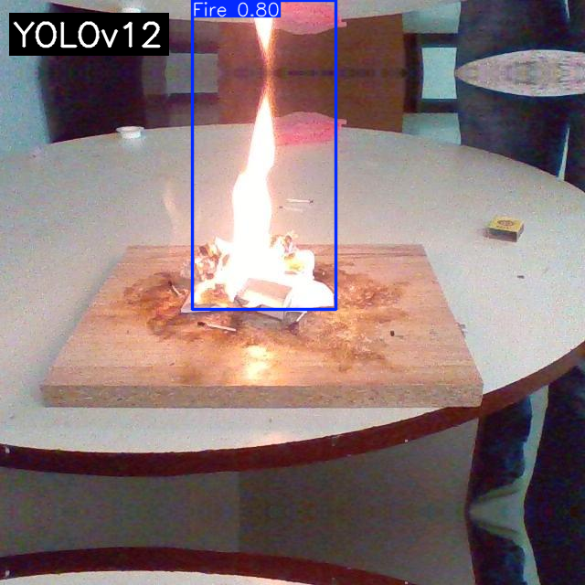 |

</details>

## Analysis & Visualizations

### Performance Analysis
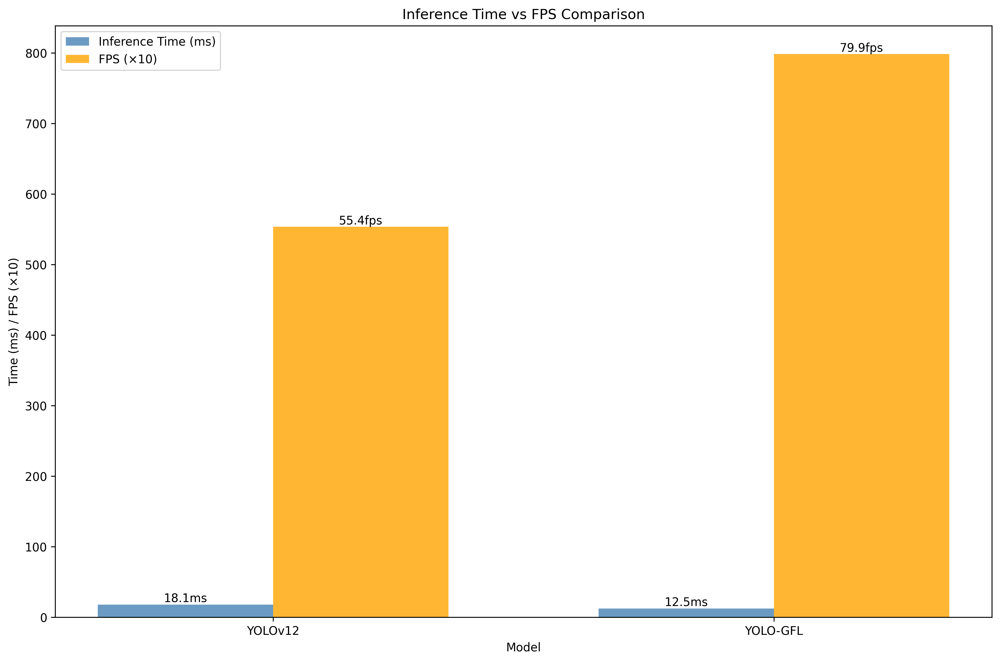

### Confusion Matrices

#### Test Set Evaluation

<table align="center">
<tr>
<td align="center">
<h4>YOLO-GFL</h4>
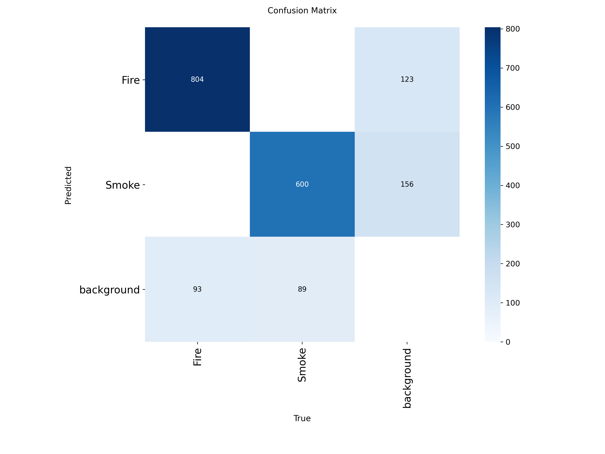
</td>
<td align="center">
<h4>YOLOv12</h4>
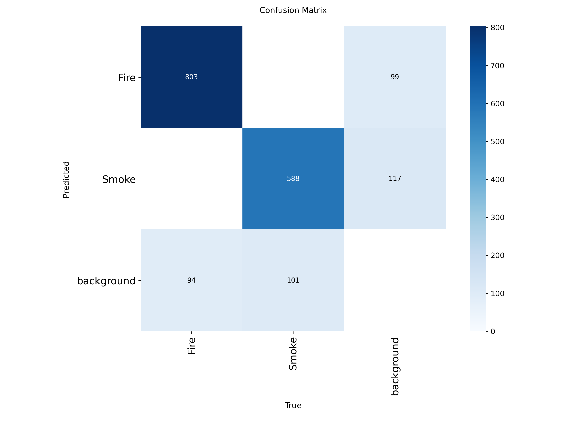
</td>
</tr>
</table>

#### Training Validation Set

<table align="center">
<tr>
<td align="center">
<h4>YOLO-GFL Training</h4>

</td>
<td align="center">
<h4>YOLOv12 Training</h4>
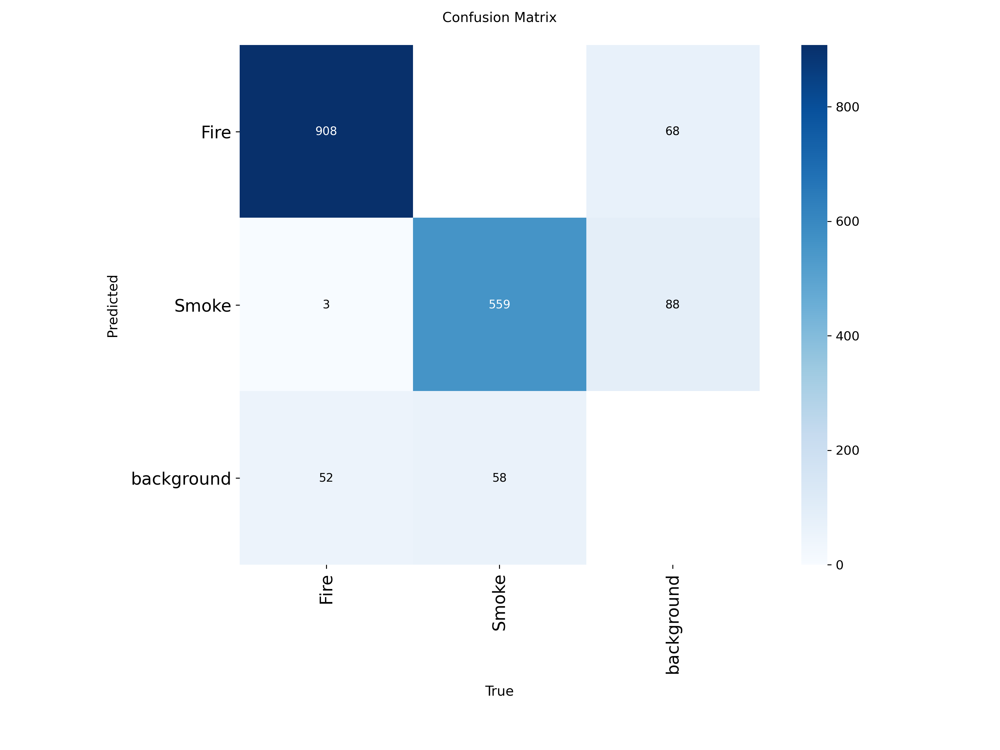
</td>
</tr>
</table>

### Training Progress

<table align="center">
<tr>
<td align="center">
<h4>YOLO-GFL Training Metrics</h4>
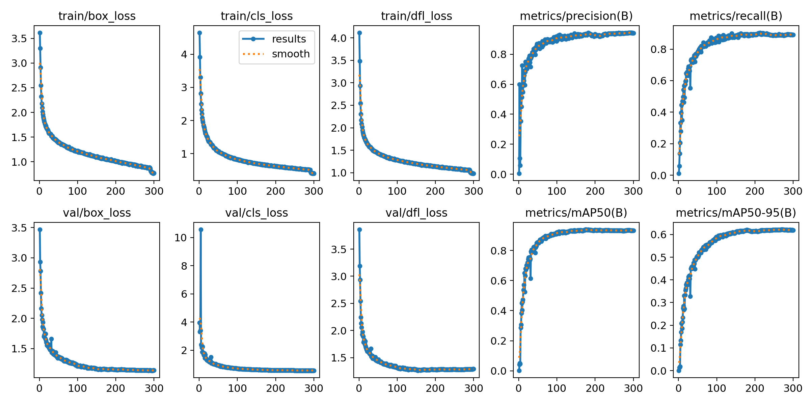
</td>
<td align="center">
<h4>YOLOv12 Training Metrics</h4>
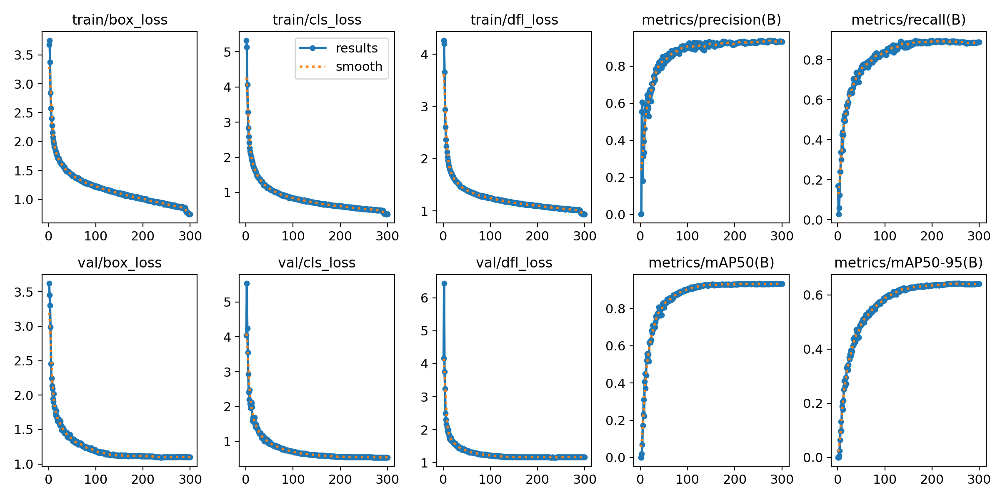
</td>
</tr>
</table>

## Technical Implementation

The YOLO-GFL architecture integrates GhostNet-based modules to achieve model compression while maintaining detection accuracy. Key technical features include:

- **GhostNet Integration**: Efficient feature extraction with reduced computational overhead
- **Optimized Architecture**: Streamlined layer structure for faster inference
- **Memory Efficiency**: Reduced parameter count for edge deployment
- **Specialized Training**: Fine-tuned for fire and smoke detection scenarios

## Key Advantages

| Aspect          | YOLO-GFL Advantage                 |
|-----------------|------------------------------------|
| **Model Size**  | 35% smaller (3.36 MB vs 5.21 MB)   |
| **Computation** | 21% fewer GFLOPs (4.6 vs 5.8)      |
| **Parameters**  | 36% fewer parameters               |
| **Deployment**  | Better suited for edge devices     |
| **Accuracy**    | Competitive performance maintained |

## Acknowledgments

- **Dataset**: [PENG BO Home-Fire Dataset](https://github.com/PengBo0/Home-fire-dataset)
- **Baseline Model**: [YOLOv12](https://github.com/sunsmarterjie/yolov12)
- **Architecture Inspiration**: GhostNet for efficient module design

## Citation

If you use YOLO-GFL in your research, please cite:

```bibtex
@misc{yolo-gfl,
  title={YOLO-GFL: YOLO Architecture Optimization Using GhostNet-Based Modules for Indoor Fire and Smoke Detection},
  author={Syamsudin, Hilmi},
  year={2025},
  url={https://github.com/syamsudinhilmi/yolo-gfl}
}
```

---

<div align="center">
<strong>Built for Fire Safety • Optimized for Performance • Powered by GhostNet</strong>
</div>